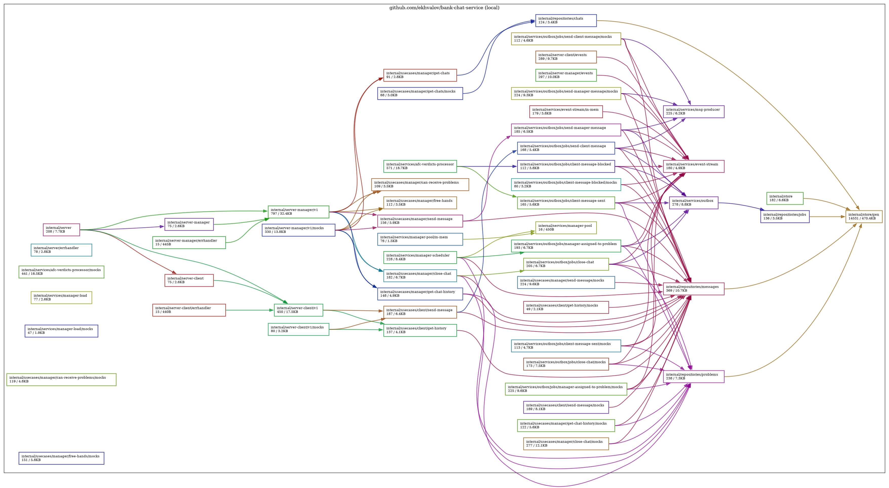

[![CC BY-NC-SA 4.0][cc-by-nc-sa-shield]][cc-by-nc-sa]

[cc-by-nc-sa]: http://creativecommons.org/licenses/by-nc-sa/4.0/
[cc-by-nc-sa-shield]: https://img.shields.io/badge/License-CC%20BY--NC--SA%204.0-lightgrey.svg

# Bank Support Chat System

## Development

### Setup environment

1. Install [Task](https://taskfile.dev/installation/)
2. Run `task tools:install`

### Graphs

  
Dependency Graph

  

### Architecture
[details](docs/ARCHITECTURE.md)
